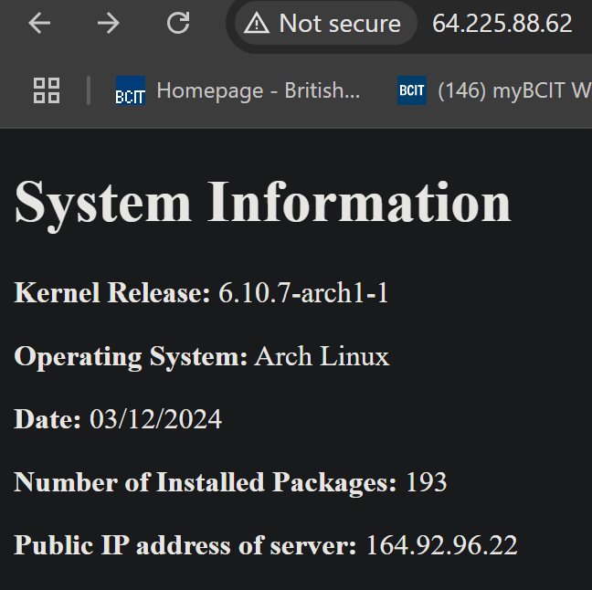

# ACIT 2420 Assignment3-Part2 #

## Introduction ##
For this assignment we will be expanding our knowledge on Nginx by configuring two servers along with a load balancer to distribute traffic among the servers. We will using DigitalOcean to create the droplets that run on Arch Linux. 

Load balancers distribute traffic across multiple servers to improve performance and reliability, while Nginx is a very useful tool that can serve web content, act as a reverse proxy, and balance loads efficiently.

## Table of Contents ##

1. [Introduction](#introduction)
2. [Task 1: Create Two New Droplets](#task-1-create-two-new-droplets)
3. [Task 2: Create Load Balancer](#task-2-create-load-balancer)
4. [Task 3: Clone Starter Code Repository](#task-3-clone-starter-code-repository)
5. [Task 4: Nginx Server Configuration](#task-4-nginx-server-configuration)
6. [Task 5: Server Verification](#task-5-server-verification)
7. [End of Assignment](#end-of-assignment)
8. [References](#references)


## Task 1: Create Two New Droplets ##
We will be creating two new droplets for our Arch Linux servers using DigitalOcean along with the tag ```web```. These tags will be utilized when creating your load balancer.

1) Click on green "Create Droplet" button 
2) Choose "SFO3" for region and datacenter
3) Use the custom image (that we used for Assignment1) for Arch Linux as OS
4) Add the tag ```web``` under "tags" 
5) Repeat the same steps above with a second droplet

## Task 2: Create Load Balancer ##

We will be creating a load balancer for the purpose of distributing traffic between our two Arch Linux servers. 

1) Click on "Load Balancer" on the side navigation menu
2) Click on "Create Load Balancer"
3) Choose "SFO3" for region and datacenter
4) Choose "External (public)" for type
5) Use the ```web ``` tag 

## Task 3: Clone Starter Code Repoistory ## 

Now we will clone the provided *updated* starter code from a repository. This will contain the new generate_index script that will generate an updated HTML script. 

1) SSH into your server and run the following command:

```git clone http://git.sr.ht/~nathan_climbs/2420-as3-p2-start```

2) Create a system user: 

```sudo useradd -r -d /var/lib/webgen -s /usr/sbin/nologin webgen```

3) Create directory for the user:

```sudo mkdir -p /var/lib/webgen```

```sudo mkdir -p /var/lib/webgen/bin /var/lib/webgen/HTML /var/lib/webgen/documents```


4) Move script to directory:

```sudo mv 2420-as3-p2-start/generate_index /var/lib/webgen/bin/```

5) Give execute permissions for script:

```sudo chmod +x generate_index```

6) Create document files: 

```sudo touch /var/lib/webgen/documents/file-one /var/lib/webgen/documents/file-two```

Your file structure should look like this: 
```
/var/bin/webgen/
 .
 ├── bin/
 │   └── generate_index
 ├── documents/
 │   ├── file-one
 │   └── file-two
 └── HTML/
 ```

7) Change ownership for the system user: 

```sudo chown -R webgen:webgen /var/lib/webgen```

8) Repeat above steps for your other server

## Task 4: Nginx Server Configuration ##

Server blocks configure web servers to handle requests for specific domains or paths, defining document roots and settings for each site.

>[!NOTE] 
>For this task, we will be configurating the servers on both droplets. Ensure that you repeat each of the steps below for the other existing server.

1) Update server block: 

```sudo nvim /etc/nginx/sites-available/webgen.conf```

2) Add the following code: 

```
      listen 80;
      listen [::]:80;

      server_name localhost.webgen;

      location / {
           root /var/lib/webgen/HTML;
           index index.html;
           try_files $uri $uri/ =404;
      }

      # Handle /documents/ requests
      location /documents {
           alias /var/lib/webgen/documents/;
           autoindex on;
           autoindex_exact_size off;
           autoindex_localtime on;
           try_files $uri $uri/ =404;
      }
```
**Code explained**: 
- ```location:``` This block specifies the /documents URL path
- ```alias :``` Replaces URL path with directory path
- ```autoindex on; :``` if there is no index.html file, it will enable directory listing
- ```autoindex_exact_size off :``` This will display files in human readable format
- ```autoindex_localtime_on :``` Displays the file timestamp in the user's local timezone 

3) Test the configuration for any errors:

```sudo nginx -t``` 

4) Run the following commands to start/enable Nginx: 
```
sudo systemctl enable nginx
sudo systemctl start nginx
sudo systemctl status nginx
```
## Task 5: Server Verification ##

After the configuration has been completed on both servers, we will be verifying that they are running properly and that the load balancer is distributing the traffic.

1) Copy the load balancer IP address 
2) Access the server by entering load balancer IP address into the web: 

```http://load-balancer-ipaddr```

It should look like this:



3) Go to documents directory to ensure files are served:

```http://load-balancer-ipaddr/documents```

It should look like this: 


## End of Assignment ##

Congrats on the completion of setting up two servers along with the load balancer! 

## References ##

1. **DigitalOcean Documentation**  
   [Creating Droplets](https://docs.digitalocean.com/products/droplets/how-to/create/) - Step-by-step guide for creating and managing Droplets on DigitalOcean.  

2. **Nginx Documentation**  
   [NGINX Configuration](https://nginx.org/en/docs/beginners_guide.html) - Official guide for configuring Nginx server blocks and load balancing.  

3. **Arch Linux Wiki**  
   [Arch Linux Installation Guide](https://wiki.archlinux.org/title/Installation_guide) - Detailed instructions on installing and configuring Arch Linux.  
   [Nginx on Arch](https://wiki.archlinux.org/title/Nginx) - Instructions for setting up Nginx on Arch Linux.

4. **Git Documentation**  
   [Cloning a Repository](https://git-scm.com/book/en/v2/Git-Basics-Getting-a-Git-Repository#Cloning-an-Existing-Repository) - Guide on how to clone repositories using Git.

5. **Systemd Documentation**  
   [Systemd User Services](https://www.freedesktop.org/wiki/Software/systemd/) - Documentation on managing services with `systemctl`.

6. **Linux Man Pages**  
   - [chmod](https://man7.org/linux/man-pages/man1/chmod.1.html)  
   - [chown](https://man7.org/linux/man-pages/man1/chown.1.html)  
   - [nginx](https://man7.org/linux/man-pages/man8/nginx.8.html)  

